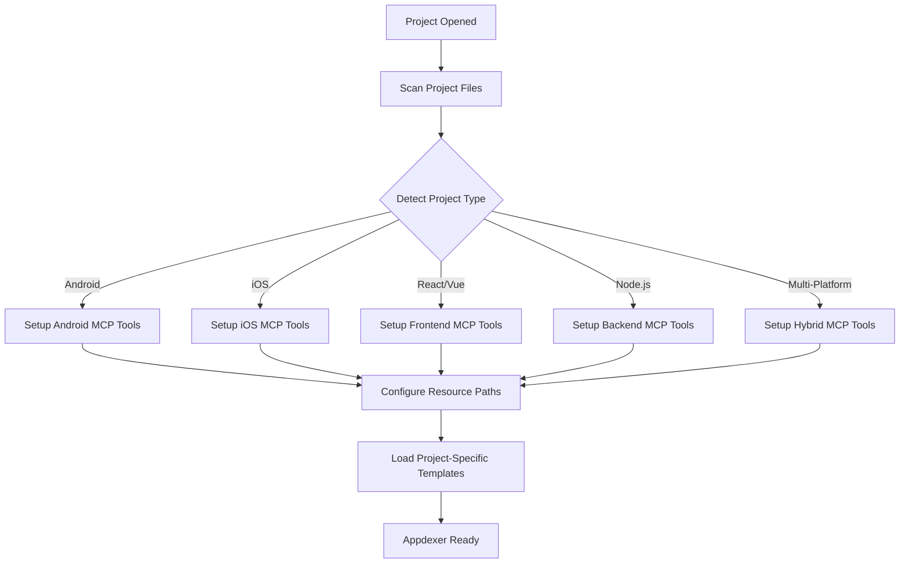

# Appdexer - Multi-Project Resource Management System

## 🎯 Tổng Quan Dự Án

### **Mục Tiêu Chính**

Phát triển **Appdexer** - hệ thống quản lý tài nguyên thông minh được tích hợp vào Review-Gate V2, hỗ trợ đa dự án với khả năng:

**🎤 User-Initiated Voice Search:**

- Voice commands để tìm icons: "Find home icon for navigation"
- Multilingual voice recognition cho các ngôn ngữ khác nhau
- Real-time audio processing và feedback

**🤖 AI-Callable MCP Functions:**

- AI tự động detect context và gọi appropriate MCP tools
- Smart suggestions dựa trên project type và current files
- Cross-project knowledge sharing

**⚙️ Auto-Setup MCP Tools:**

- Tự động detect project type (Android/iOS/Node.js/React/Vue...)
- Auto-configure MCP endpoints phù hợp với tech stack
- Dynamic tool loading dựa trên project requirements

### **Lợi Ích Kỳ Vọng**

- **🎯 Universal Project Support**: Hoạt động seamless với Android, iOS, React, Vue, Node.js...
- **🎤 Natural Voice Interface**: "Tìm icon home cho navigation Android" → auto download & integrate
- **🤖 AI Context Awareness**: AI tự động hiểu project context và suggest resources phù hợp
- **⚡ Zero-Config Setup**: Detect project type → auto setup MCP tools → ready to use
- **📱 Cross-Platform Resource Management**: Smart organize theo platform conventions
- **🔄 Live Project Sync**: Real-time sync resources across multiple projects

## 📊 **Phân Tích Hiện Trạng**

### **Icon Library Worker (Available)**

✅ **API Endpoints sẵn sàng:**

- `/icon-sets` - Lấy danh sách bộ icons
- `/search?q=query` - Tìm kiếm icons
- `/suggest?context=...` - AI suggest icons theo context
- `/icon-sets/:id/icons/:name` - Download specific icon
- Integration code generation (React, Vue, etc.)

✅ **MCP Server đã có:**

- `icon-library-mcp.js` với đầy đủ functions
- Cache system cho performance
- Support multiple frameworks
- Supabase integration

### **Review-Gate V2 (Hiện Tại)**

✅ **Core Features:**

- Multi-modal popup (text, voice, images)
- MCP integration với Cursor
- Extension system với webview
- File upload/download capabilities

❌ **Missing for Icon Integration:**

- Icon search interface trong popup
- Icon preview và selection
- Download và organize workflow
- Integration với project folder structure

## 🏗️ **Kiến Trúc Appdexer System**

### **Multi-Project Detection Matrix**

| Project Type     | Detection Signals                         | MCP Tools                        | Resource Paths               | Conventions                        |
| ---------------- | ----------------------------------------- | -------------------------------- | ---------------------------- | ---------------------------------- |
| **Android**      | `app/build.gradle`, `AndroidManifest.xml` | android_icons, drawable_manager  | `app/src/main/res/drawable/` | vector drawables, density variants |
| **iOS**          | `*.xcodeproj`, `Info.plist`               | ios_assets, bundle_manager       | `Assets.xcassets/`           | @1x, @2x, @3x variants             |
| **React**        | `package.json` + `react` dependency       | react_icons, component_generator | `src/assets/icons/`          | JSX components, SVG imports        |
| **Vue**          | `package.json` + `vue` dependency         | vue_icons, component_generator   | `src/assets/icons/`          | Vue components, SVG imports        |
| **Node.js**      | `package.json` + no frontend deps         | web_assets, static_manager       | `public/assets/`             | Static file serving                |
| **Flutter**      | `pubspec.yaml`, `lib/main.dart`           | flutter_assets, widget_generator | `assets/icons/`              | Asset declarations in pubspec      |
| **React Native** | `package.json` + `react-native`           | rn_assets, platform_manager      | `assets/icons/`              | Platform-specific imports          |

### **Auto-Setup Workflow**



## 🚀 **Kế Hoạch Triển Khai**

### **Phase 1: Core Detection & Auto-Setup Engine**

#### **1.1 Project Detection Engine**

**File: `tools/review-gate-v2/appdexer/project_detector.py`**

```python
import os
import json
from pathlib import Path
from typing import Dict, List, Optional
from enum import Enum

class ProjectType(Enum):
    ANDROID = "android"
    IOS = "ios"
    REACT = "react"
    VUE = "vue"
    NODEJS = "nodejs"
    FLUTTER = "flutter"
    REACT_NATIVE = "react_native"
    UNKNOWN = "unknown"

class ProjectDetector:
    """Auto-detect project type và setup appropriate MCP tools"""

    def __init__(self, project_root: str):
        self.project_root = Path(project_root)
        self.detected_types: List[ProjectType] = []

    async def detect_project_type(self) -> List[ProjectType]:
        """Scan project files và return detected types"""
        detectors = [
            self._detect_android,
            self._detect_ios,
            self._detect_flutter,
            self._detect_react,
            self._detect_vue,
            self._detect_react_native,
            self._detect_nodejs,
        ]

        for detector in detectors:
            if await detector():
                pass  # Multiple types có thể được detect

        return self.detected_types

    async def _detect_android(self) -> bool:
        signals = [
            "app/build.gradle",
            "build.gradle",
            "AndroidManifest.xml",
            "app/src/main/AndroidManifest.xml"
        ]
        return self._check_signals(signals, ProjectType.ANDROID)

    async def _detect_ios(self) -> bool:
        signals = [
            "*.xcodeproj",
            "*.xcworkspace",
            "Info.plist",
            "ios/Info.plist"
        ]
        return self._check_signals(signals, ProjectType.IOS, use_glob=True)

    async def _detect_flutter(self) -> bool:
        signals = ["pubspec.yaml", "lib/main.dart"]
        return self._check_signals(signals, ProjectType.FLUTTER)

    async def _detect_react(self) -> bool:
        if self._check_package_json_dependency("react"):
            self.detected_types.append(ProjectType.REACT)
            return True
        return False

    async def _detect_vue(self) -> bool:
        if self._check_package_json_dependency("vue"):
            self.detected_types.append(ProjectType.VUE)
            return True
        return False

    async def _detect_react_native(self) -> bool:
        if self._check_package_json_dependency("react-native"):
            self.detected_types.append(ProjectType.REACT_NATIVE)
            return True
        return False

    async def _detect_nodejs(self) -> bool:
        # Node.js nếu có package.json nhưng không có frontend frameworks
        package_json = self.project_root / "package.json"
        if package_json.exists() and not any([
            self._check_package_json_dependency("react"),
            self._check_package_json_dependency("vue"),
            self._check_package_json_dependency("react-native")
        ]):
            self.detected_types.append(ProjectType.NODEJS)
            return True
        return False
```

#### **1.2 MCP Tools Auto-Loader**

**File: `tools/review-gate-v2/appdexer/mcp_loader.py`**

```python
class MCPToolsLoader:
    """Dynamically load MCP tools based on detected project types"""

    def __init__(self):
        self.loaded_tools = {}
        self.project_configs = {}

    async def setup_tools_for_project(self, project_types: List[ProjectType], project_root: str):
        """Setup MCP tools cho detected project types"""

        for project_type in project_types:
            tools = await self._get_tools_for_type(project_type)
            config = await self._get_config_for_type(project_type, project_root)

            self.loaded_tools[project_type] = tools
            self.project_configs[project_type] = config

    async def _get_tools_for_type(self, project_type: ProjectType) -> List[str]:
        """Return list of MCP tools cho specific project type"""

        tool_mapping = {
            ProjectType.ANDROID: [
                "android_icon_search",
                "android_drawable_manager",
                "android_resource_generator",
                "vector_drawable_converter"
            ],
            ProjectType.IOS: [
                "ios_asset_search",
                "ios_bundle_manager",
                "ios_icon_generator",
                "ios_size_variants"
            ],
            ProjectType.REACT: [
                "react_icon_search",
                "react_component_generator",
                "svg_optimizer",
                "react_icon_import_generator"
            ],
            ProjectType.VUE: [
                "vue_icon_search",
                "vue_component_generator",
                "svg_optimizer",
                "vue_icon_import_generator"
            ],
            ProjectType.NODEJS: [
                "web_asset_manager",
                "static_file_organizer",
                "svg_optimizer"
            ],
            ProjectType.FLUTTER: [
                "flutter_asset_manager",
                "flutter_icon_generator",
                "pubspec_updater"
            ],
            ProjectType.REACT_NATIVE: [
                "rn_asset_manager",
                "rn_platform_manager",
                "rn_icon_generator"
            ]
        }

        return tool_mapping.get(project_type, [])
```

#### **1.2 Configuration Management**

**File: `tools/review-gate-v2/config.json`**

```json
{
  "icon_library": {
    "api_url": "https://icon-library.trungkientn.workers.dev",
    "default_download_path": "assets/icons",
    "auto_organize": true,
    "preferred_formats": ["svg", "png"],
    "preferred_sizes": [24, 32, 48, 64]
  },
  "review_gate": {
    "enable_icon_search": true,
    "icon_preview_limit": 50,
    "auto_suggest_context": true
  }
}
```

### **Phase 2: Voice Search & AI Integration**

#### **2.1 User-Initiated Voice Search**

**File: `tools/review-gate-v2/appdexer/voice_processor.py`**

```python
import speech_recognition as sr
import pyttsx3
from typing import Dict, Optional
import asyncio

class VoiceSearchProcessor:
    """Handle voice commands for icon/resource search"""

    def __init__(self):
        self.recognizer = sr.Recognizer()
        self.microphone = sr.Microphone()
        self.tts_engine = pyttsx3.init()
        self.active_languages = ["vi-VN", "en-US"]

    async def listen_for_command(self) -> Optional[Dict]:
        """Listen for voice command và return parsed intent"""
        try:
            with self.microphone as source:
                # Adjust for ambient noise
                self.recognizer.adjust_for_ambient_noise(source)

            # Listen for audio
            with self.microphone as source:
                audio = self.recognizer.listen(source, timeout=5)

            # Try multiple languages
            for language in self.active_languages:
                try:
                    text = self.recognizer.recognize_google(audio, language=language)
                    intent = await self._parse_voice_intent(text, language)
                    if intent:
                        return intent
                except sr.UnknownValueError:
                    continue

        except Exception as e:
            await self._speak_feedback("Không nghe thấy rõ, bạn có thể nói lại không?")

        return None

    async def _parse_voice_intent(self, text: str, language: str) -> Optional[Dict]:
        """Parse voice command into actionable intent"""

        # Vietnamese patterns
        vietnamese_patterns = {
            r"tìm.*icon.*(\w+)": {"action": "search", "type": "icon"},
            r"tải.*icon.*(\w+)": {"action": "download", "type": "icon"},
            r"icon.*(\w+).*cho.*(\w+)": {"action": "search", "type": "icon", "context": True},
        }

        # English patterns
        english_patterns = {
            r"find.*icon.*(\w+)": {"action": "search", "type": "icon"},
            r"search.*(\w+).*icon": {"action": "search", "type": "icon"},
            r"download.*icon.*(\w+)": {"action": "download", "type": "icon"},
        }

        patterns = vietnamese_patterns if language == "vi-VN" else english_patterns

        for pattern, intent_base in patterns.items():
            import re
            match = re.search(pattern, text.lower())
            if match:
                intent = intent_base.copy()
                intent["query"] = match.group(1) if match.groups() else text
                intent["original_text"] = text
                intent["language"] = language
                return intent

        return None

    async def _speak_feedback(self, message: str):
        """Provide voice feedback to user"""
        self.tts_engine.say(message)
        self.tts_engine.runAndWait()
```

**Enhanced Extension UI with Voice:**

```javascript
// File: tools/review-gate-v2/cursor-extension/voice_interface.js

class VoiceInterface {
  constructor() {
    this.isListening = false;
    this.recognition = new (window.SpeechRecognition ||
      window.webkitSpeechRecognition)();
    this.setupVoiceRecognition();
  }

  setupVoiceRecognition() {
    this.recognition.continuous = false;
    this.recognition.interimResults = false;
    this.recognition.lang = "vi-VN"; // Default Vietnamese

    this.recognition.onresult = (event) => {
      const transcript = event.results[0][0].transcript;
      this.processVoiceCommand(transcript);
    };

    this.recognition.onerror = (event) => {
      console.log("Voice recognition error:", event.error);
      this.showVoiceError("Không nghe thấy rõ, vui lòng thử lại");
    };
  }

  startListening() {
    if (!this.isListening) {
      this.isListening = true;
      this.recognition.start();
      this.showVoiceIndicator("Đang nghe...");
    }
  }

  async processVoiceCommand(transcript) {
    this.showVoiceIndicator("Đang xử lý...");

    // Send to MCP for processing
    const response = await vscode.postMessage({
      command: "callMcpTool",
      tool: "voice_search_processor",
      arguments: { transcript },
    });

    if (response.success) {
      await this.executeVoiceCommand(response.intent);
    } else {
      this.showVoiceError("Không hiểu lệnh, vui lòng thử lại");
    }

    this.isListening = false;
  }

  async executeVoiceCommand(intent) {
    switch (intent.action) {
      case "search":
        await this.performVoiceSearch(intent.query, intent.context);
        break;
      case "download":
        await this.performVoiceDownload(intent.query);
        break;
      default:
        this.showVoiceError("Lệnh chưa được hỗ trợ");
    }
  }
}
```

#### **2.2 Icon Preview & Selection System**

**JavaScript Functions:**

```javascript
async function searchIcons(query, filters = {}) {
  // Call MCP tool icon_search
  const response = await vscode.postMessage({
    command: "callMcpTool",
    tool: "icon_search",
    arguments: { query, ...filters },
  });
  displayIconResults(response.results);
}

function displayIconResults(icons) {
  // Render icon grid với preview
  // Enable selection và download
}

async function downloadSelectedIcons(selectedIcons, targetPath) {
  // Batch download icons
  // Show progress
  // Update project structure
}
```

### **Phase 3: AI-Callable MCP Functions**

#### **3.1 Smart AI Context Detection**

**File: `tools/review-gate-v2/appdexer/ai_context_analyzer.py`**

```python
from typing import Dict, List, Optional
import re
import ast

class AIContextAnalyzer:
    """Analyze code context để tự động suggest appropriate resources"""

    def __init__(self, project_detector):
        self.project_detector = project_detector
        self.context_patterns = self._load_context_patterns()

    async def analyze_current_context(self, cursor_context: Dict) -> Dict:
        """Analyze current cursor position để understand context"""

        current_file = cursor_context.get("current_file", "")
        current_line = cursor_context.get("current_line", "")
        open_files = cursor_context.get("open_files", [])

        context = {
            "file_type": self._detect_file_type(current_file),
            "ui_context": await self._analyze_ui_context(current_line, current_file),
            "project_context": await self._analyze_project_context(open_files),
            "coding_intent": await self._detect_coding_intent(current_line)
        }

        return context

    async def _analyze_ui_context(self, current_line: str, file_path: str) -> Dict:
        """Detect UI-related context từ current code"""

        ui_patterns = {
            # Android patterns
            r"ImageView|ImageButton": {"platform": "android", "component": "image"},
            r"FloatingActionButton": {"platform": "android", "component": "fab"},
            r"BottomNavigationView": {"platform": "android", "component": "navigation"},

            # React patterns
            r"<.*Icon.*>": {"platform": "react", "component": "icon"},
            r"import.*Icon.*from": {"platform": "react", "component": "icon_import"},

            # Flutter patterns
            r"Icon\(": {"platform": "flutter", "component": "icon"},
            r"IconButton\(": {"platform": "flutter", "component": "icon_button"},
        }

        for pattern, context in ui_patterns.items():
            if re.search(pattern, current_line):
                return context

        return {}

    async def _detect_coding_intent(self, current_line: str) -> Optional[str]:
        """Detect what user is trying to code"""

        intent_patterns = {
            r"TODO.*icon|FIXME.*icon": "need_icon",
            r"Button.*text.*=.*": "button_styling",
            r"navigation|menu": "navigation_ui",
            r"login|auth": "auth_ui",
            r"profile|user": "user_ui",
            r"search": "search_ui",
        }

        for pattern, intent in intent_patterns.items():
            if re.search(pattern, current_line.lower()):
                return intent

        return None

class AutoResourceSuggester:
    """AI tự động suggest resources based on context"""

    def __init__(self, context_analyzer, icon_library):
        self.context_analyzer = context_analyzer
        self.icon_library = icon_library

    async def auto_suggest_for_ai(self, user_message: str, cursor_context: Dict) -> List[Dict]:
        """Entry point cho AI để auto-suggest resources"""

        # Analyze both user intent và code context
        message_intent = await self._analyze_message_intent(user_message)
        code_context = await self.context_analyzer.analyze_current_context(cursor_context)

        suggestions = []

        # Combine intent analysis
        if message_intent.get("needs_icons") or code_context.get("ui_context"):
            icon_suggestions = await self._suggest_icons(message_intent, code_context)
            suggestions.extend(icon_suggestions)

        return suggestions

    async def _analyze_message_intent(self, message: str) -> Dict:
        """Analyze user message để understand intent"""

        intent_keywords = {
            "ui": ["button", "interface", "screen", "page", "component"],
            "navigation": ["menu", "nav", "navigation", "tab", "drawer"],
            "actions": ["save", "delete", "edit", "add", "remove", "submit"],
            "social": ["share", "like", "comment", "follow", "social"],
            "media": ["photo", "video", "audio", "camera", "gallery"],
        }

        detected_intents = []
        message_lower = message.lower()

        for category, keywords in intent_keywords.items():
            if any(keyword in message_lower for keyword in keywords):
                detected_intents.append(category)

        return {
            "categories": detected_intents,
            "needs_icons": len(detected_intents) > 0,
            "specific_requests": self._extract_specific_requests(message)
        }

    async def _suggest_icons(self, message_intent: Dict, code_context: Dict) -> List[Dict]:
        """Generate icon suggestions based on combined context"""

        suggestions = []

        # Determine search queries from context
        search_queries = []

        # From message intent
        for category in message_intent.get("categories", []):
            search_queries.append(category)

        # From code context
        ui_context = code_context.get("ui_context", {})
        if ui_context.get("component"):
            search_queries.append(ui_context["component"])

        coding_intent = code_context.get("coding_intent")
        if coding_intent:
            search_queries.append(coding_intent.replace("_", " "))

        # Search for relevant icons
        for query in search_queries:
            icons = await self.icon_library.search_icons(
                query=query,
                limit=3,  # Top 3 cho mỗi category
                platform=ui_context.get("platform")
            )

            suggestions.extend([
                {
                    "type": "icon",
                    "query": query,
                    "platform": ui_context.get("platform"),
                    "icons": icons,
                    "confidence": self._calculate_confidence(query, message_intent, code_context)
                }
            ])

        return suggestions
```

#### **3.2 MCP Tools cho AI Assistant**

**File: `tools/review-gate-v2/appdexer/ai_mcp_tools.py`**

```python
# MCP Tools mà AI có thể gọi trực tiếp

@mcp_tool
async def auto_detect_resource_needs(context: Dict) -> Dict:
    """
    AI gọi tool này để automatically detect xem user có cần resources không
    """
    analyzer = AIContextAnalyzer(project_detector)
    suggester = AutoResourceSuggester(analyzer, icon_library)

    suggestions = await suggester.auto_suggest_for_ai(
        user_message=context.get("user_message", ""),
        cursor_context=context.get("cursor_context", {})
    )

    return {
        "has_suggestions": len(suggestions) > 0,
        "suggestions": suggestions,
        "auto_actions": await _determine_auto_actions(suggestions)
    }

@mcp_tool
async def smart_icon_search(query: str, project_context: Dict) -> Dict:
    """
    AI-optimized icon search với project-aware filtering
    """
    project_types = project_context.get("project_types", [])
    current_file = project_context.get("current_file", "")

    # Auto-enhance query với project context
    enhanced_query = await _enhance_query_with_context(query, project_types, current_file)

    results = await icon_library.search_icons(
        query=enhanced_query,
        platform=_determine_preferred_platform(project_types),
        style=_determine_preferred_style(project_types),
        limit=10
    )

    return {
        "query": enhanced_query,
        "original_query": query,
        "results": results,
        "project_optimized": True
    }

@mcp_tool
async def bulk_resource_setup(setup_request: Dict) -> Dict:
    """
    AI có thể request setup multiple resources cùng lúc
    """
    resources = setup_request.get("resources", [])
    target_project = setup_request.get("project_path", "")

    results = []

    for resource in resources:
        if resource["type"] == "icon":
            result = await _setup_icon_resource(resource, target_project)
            results.append(result)
        elif resource["type"] == "asset":
            result = await _setup_asset_resource(resource, target_project)
            results.append(result)

    return {
        "setup_results": results,
        "success_count": len([r for r in results if r.get("success")]),
        "total_count": len(results)
    }
```

ICON_SUGGESTION_PROMPTS = {
"ui_development": "User is developing UI. Suggest appropriate UI icons.",
"mobile_app": "User building mobile app. Suggest mobile-specific icons.",
"web_dashboard": "User creating dashboard. Suggest data visualization icons.",
"ecommerce": "User building ecommerce. Suggest shopping related icons."
}

````

#### **3.2 Voice-Activated Icon Search**

**Enhanced Speech Processing:**

```python
async def _process_voice_icon_request(self, audio_transcription):
    """
    Process voice commands cho icon search
    Example: "Tìm icon home cho navigation menu"
    """
    # Parse voice command
    intent = self._parse_icon_intent(audio_transcription)

    if intent.type == "icon_search":
        results = await self.icon_library.search_icons(
            query=intent.query,
            context=intent.context
        )
        return self._format_voice_icon_response(results)
````

### **Phase 4: Project Integration**

#### **4.1 Smart Folder Organization**

**Auto-Organization System:**

```python
class ProjectIconOrganizer:
    def __init__(self, project_root):
        self.project_root = Path(project_root)
        self.icons_dir = self.project_root / "assets" / "icons"

    async def organize_downloaded_icon(self, icon_data, context_hint=""):
        """
        Automatically organize icons vào appropriate folders
        """
        # Detect project type (React, Vue, Android, etc.)
        project_type = self._detect_project_type()

        # Create appropriate folder structure
        target_dir = self._get_target_directory(icon_data, project_type, context_hint)

        # Download và save icon
        return await self._save_icon(icon_data, target_dir)

    def _detect_project_type(self):
        # Detect từ package.json, build.gradle, etc.
        pass

    def _get_target_directory(self, icon_data, project_type, context):
        # Smart directory selection based on icon purpose
        # Example: UI icons → ui/, Social icons → social/
        pass
```

#### **4.2 Integration Code Generation**

**Framework-Specific Code Generation:**

```python
async def _generate_integration_code(self, icon_path, project_type):
    """
    Generate ready-to-use code cho different frameworks
    """
    generators = {
        "react": self._generate_react_component,
        "vue": self._generate_vue_component,
        "android": self._generate_android_drawable,
        "ios": self._generate_ios_asset
    }

    if project_type in generators:
        return generators[project_type](icon_path)
```

### **Phase 5: Advanced Features**

#### **5.1 Icon Customization**

**Color & Size Customization:**

```javascript
// Icon customization interface
function showIconCustomization(iconData) {
  // Color picker
  // Size selector
  // Format converter (SVG → PNG, etc.)
  // Real-time preview
}
```

#### **5.2 Batch Operations**

**Bulk Icon Management:**

```python
async def _handle_batch_icon_operations(self, operation_type, icon_list):
    """
    Handle bulk operations: download, organize, customize
    """
    if operation_type == "batch_download":
        return await self._batch_download_icons(icon_list)
    elif operation_type == "batch_organize":
        return await self._batch_organize_icons(icon_list)
```

#### **5.3 Icon Library Sync**

**Periodic Updates:**

```python
async def _sync_icon_library(self):
    """
    Periodically sync với icon library để get new icons
    """
    # Check for new icon sets
    # Update cache
    # Notify user về new available icons
```

## 🛠️ **Appdexer Implementation Timeline**

### **📅 Tuần 1-2: Phase 1 - Core Detection Engine**

- ⚙️ Project type detection matrix (Android, iOS, React, Vue, Node.js, Flutter...)
- ⚙️ Auto-setup MCP loader với dynamic tool loading
- ⚙️ Multi-platform resource path configuration
- ⚙️ Basic project identity management system

### **📅 Tuần 3-4: Phase 2 - Voice & AI Integration**

- 🎤 Voice search processor với multilingual support (Vietnamese + English)
- 🤖 AI context analyzer for automatic resource detection
- 🔊 Real-time audio feedback system với text-to-speech
- 🌍 Cross-platform voice command patterns

### **📅 Tuần 5-6: Phase 3 - AI-Callable Functions**

- 🎯 Smart MCP tools cho AI assistant integration
- 🔍 Auto-detect resource needs functionality
- 📦 Bulk resource setup capabilities
- 💡 Context-aware suggestion engine

### **📅 Tuần 7-8: Phase 4 - Extension Integration**

- 🖥️ Review-Gate UI enhancement với voice interface
- ⚡ Real-time project detection trong extension
- 🎭 Multi-modal resource management (voice + text + visual)
- 🔄 Cross-project resource sync

### **📅 Tuần 9-10: Phase 5 - Production Ready**

- 🚀 Performance optimization cho multi-project scenarios
- 🎯 Advanced voice recognition fine-tuning
- 📚 Documentation và deployment guides
- 🧪 Integration testing với various project types

## 📋 **Technical Specifications**

### **New MCP Tools Schema**

```python
{
  "icon_search": {
    "description": "Search for icons using query và filters",
    "parameters": {
      "query": "string",
      "category": "string (optional)",
      "style": "string (optional)",
      "limit": "integer (default: 20)"
    }
  },
  "icon_suggest": {
    "description": "Get AI-suggested icons based on context",
    "parameters": {
      "context": "string",
      "project_type": "string (optional)",
      "usage_hint": "string (optional)"
    }
  },
  "icon_download": {
    "description": "Download selected icons to project",
    "parameters": {
      "icons": "array of icon objects",
      "target_path": "string (optional)",
      "organize": "boolean (default: true)"
    }
  }
}
```

### **Extension Commands**

```javascript
// New extension commands
vscode.commands.registerCommand('reviewGate.openIconSearch', ...);
vscode.commands.registerCommand('reviewGate.suggestIcons', ...);
vscode.commands.registerCommand('reviewGate.organizeIcons', ...);
```

### **File Structure After Implementation**

```
tools/review-gate-v2/
├── review_gate_v2_mcp.py              # Enhanced MCP server
├── icon_library_integration.py        # New: Icon Library API wrapper
├── project_icon_organizer.py          # New: Smart organization
├── config.json                        # New: Configuration
├── cursor-extension/
│   ├── extension.js                   # Enhanced extension
│   ├── icon-search.html               # New: Icon search UI
│   ├── icon-preview.css               # New: Icon styling
│   └── package.json                   # Updated dependencies
└── docs/
    ├── icon-integration-guide.md      # New: User guide
    └── api-reference.md               # New: API docs
```

## 🧪 **Testing Strategy**

### **Unit Tests**

- Icon Library API integration
- MCP tool functionality
- File organization logic
- Code generation accuracy

### **Integration Tests**

- End-to-end icon search workflow
- Multi-modal input handling
- Project structure integration
- Framework compatibility

### **User Testing**

- Workflow efficiency measurement
- UI/UX feedback collection
- Performance benchmarking
- Cross-platform compatibility

## 📈 **Success Metrics**

### **Efficiency Metrics**

- Icon search to integration time: < 30 seconds
- Batch download performance: 50+ icons/minute
- Context suggestion accuracy: > 80%
- User satisfaction rating: > 4.5/5

### **Adoption Metrics**

- Icons downloaded per session
- Feature usage frequency
- Integration success rate
- User retention with new features

## 🔄 **Next Steps**

1. **Validate Plan với User**
2. **Setup Development Environment**
3. **Begin Phase 1 Implementation**
4. **Create Detailed Technical Specs**
5. **Start Coding và Testing**

---

## 🎯 **Appdexer - Vision Summary**

**Appdexer** revolutionizes resource management cho developers bằng cách:

🎤 **User Voice Commands:** "Tìm icon home cho navigation Android" → AI hiểu → Auto download & integrate

🤖 **AI Smart Detection:** AI tự detect context trong code → Auto suggest appropriate resources → Seamless integration

⚙️ **Zero-Config Auto-Setup:** Open project → Detect type → Load appropriate MCP tools → Ready to use

🌍 **Universal Project Support:** Android ↔ iOS ↔ React ↔ Vue ↔ Node.js ↔ Flutter - all seamlessly supported

---

**Prepared by**: AI Assistant  
**Date**: December 2024  
**Project**: Appdexer - Multi-Project Resource Management System
